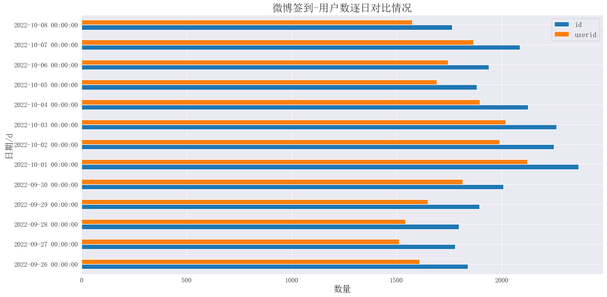
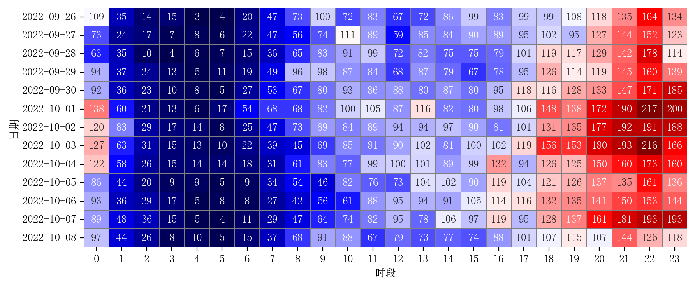
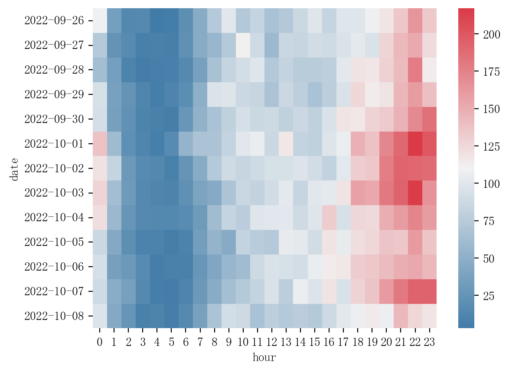
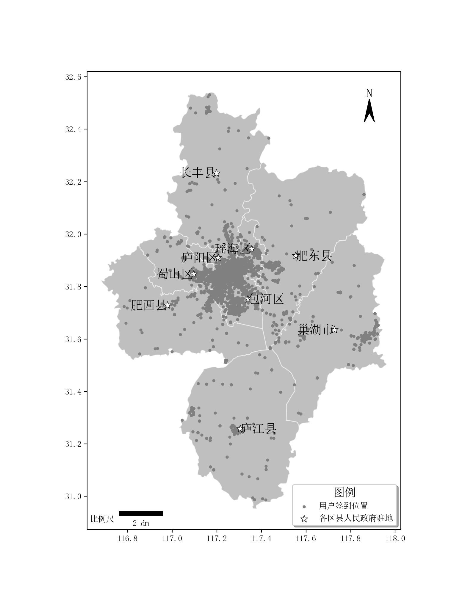
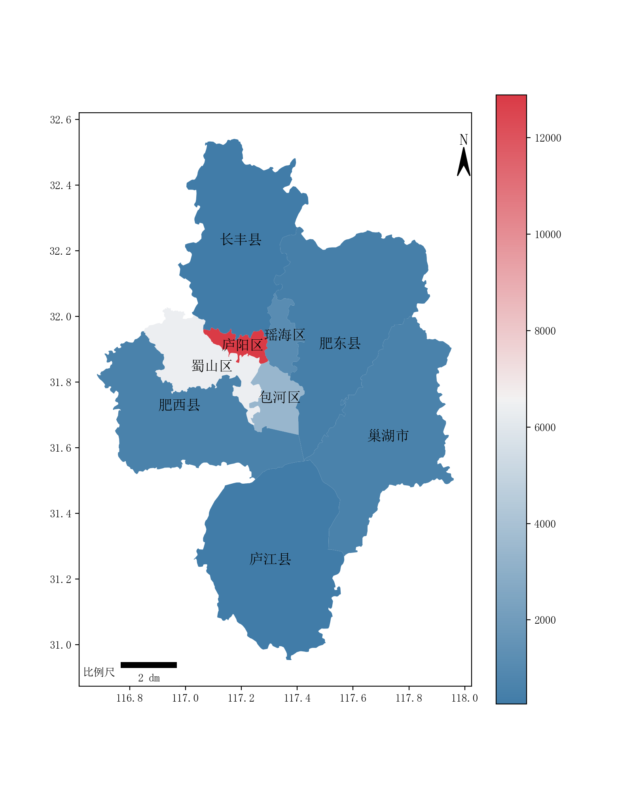
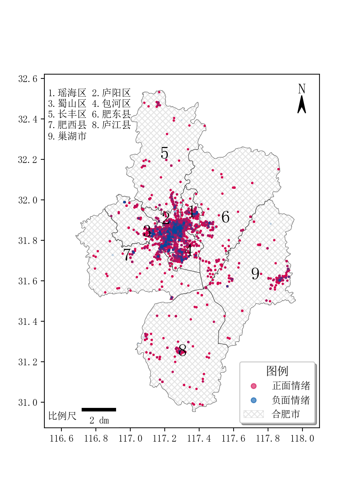
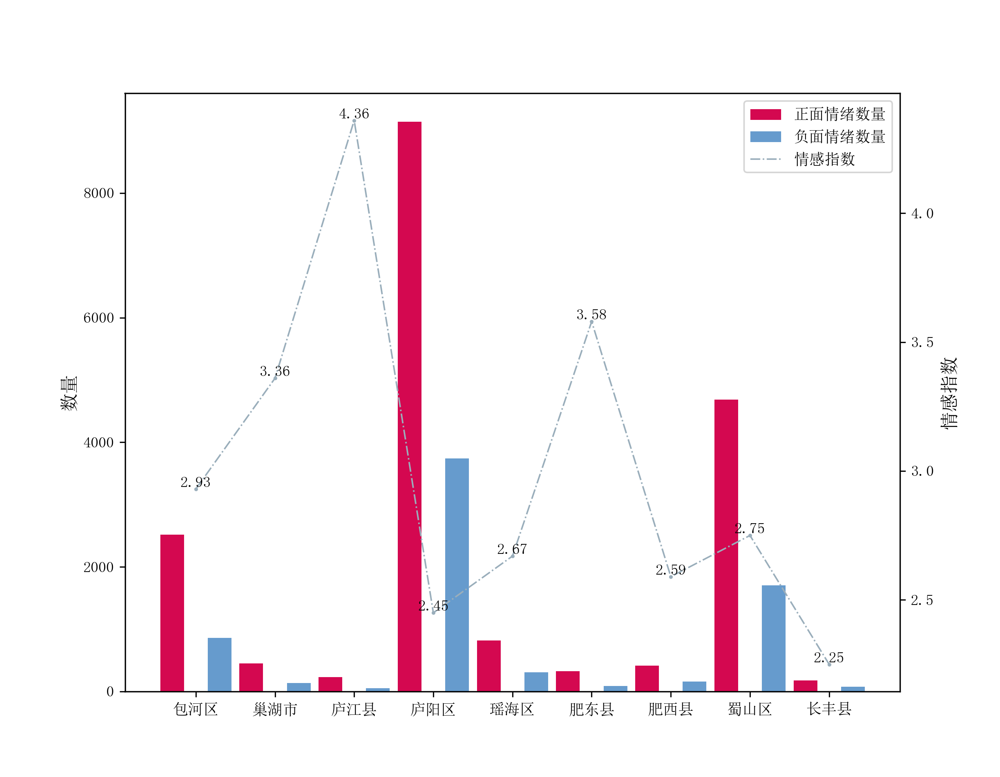

# 简介

网络舆情态势及情感多维特征分析与可视化是一个旨在理解和呈现网络上公众意见动态的研究领域。这种分析通常涉及到从社交媒体、新闻评论、论坛讨论等多个来源收集大量文本数据，然后使用自然语言处理（NLP）技术来提取有用的信息。

本项目利用微博数据，并基于BERT模型进行了情感分析，旨在探索公众在网络空间中的情绪变化。通过对大量微博帖子进行预处理和情感分类，我们分析了公众情绪在时间和空间上的分布特点，并最终绘制了情绪地图，直观展示了不同地区和时间段内的情绪波动趋势。这一可视化成果为理解公众情绪动态提供了有力的支持，并有助于相关部门及时响应社会关切。

data里面的数据（大概2.5万条微博签到，有地理坐标）可以供大家学习如何微调BERT模型并进行简单的时空分析：
- `weibo_label.csv`标注数据，正负面标签。
- `weibo_origin.csv`需要用微调好的模型进行预测。
- `weibo_pred.csv`为完成预测的数据。
- `weibo_pred.csv`为签到坐标。
- `合肥市微博情感时空分析.ipynb`为情感时空分析demo。
- `网络舆情态势及情感多维特征分析与可视化.ipynb`为主要的可视化结果图。

# Demo
## 研究区
数据为安徽省合肥市2022年9月29日-10月7日的微博签到。

 

## 签到时间特征
每日和每小时的统计。

 

 

 

## 签到空间分布
签到的总体分布以及和曲县的数据分布情况。

 

 

## 情感分析
包括节日和非节日的正负情感比较、情绪分布图和各区县的情感指数。

 

 

还有一些图表请查看笔记内容。
