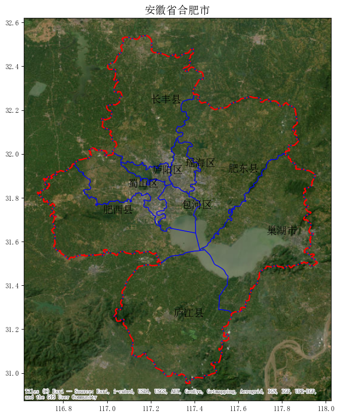

# 简介

这是一个简单的情感分析任务，`爬虫学习.ipynb`中有简单的微博数签到和微博评论据抓取，但是数据量较少。`GIS二次开发期末课程.ipynb`中只有代码示例，没有源数据，可以用作绘图参考。

data里面的数据（大概2.5万条微博签到，有地理坐标）可以供大家学习如何微调BERT模型并进行简单的时空分析：
- `weibo_label.csv`标注数据，正负面标签。
- `weibo_origin.csv`需要用微调好的模型进行预测。
- `weibo_pred.csv`为完成预测的数据。
- `weibo_pred.csv`为签到坐标，用于表的链接。
- `时空分析.ipynb`为时空分析笔记。

# 研究区
数据为安徽省合肥市2022年9月29日-10月7日的微博签到。

 

# 签到时间特征
每日和每小时的统计。

 

 

 

# 签到空间分布
签到的总体分布以及和曲县的数据分布情况。

 

 

# 情感分析
包括节日和非节日的正负情感比较、情绪分布图和各区县的情感指数。

 

 

还有一些图表请查看笔记内容。
