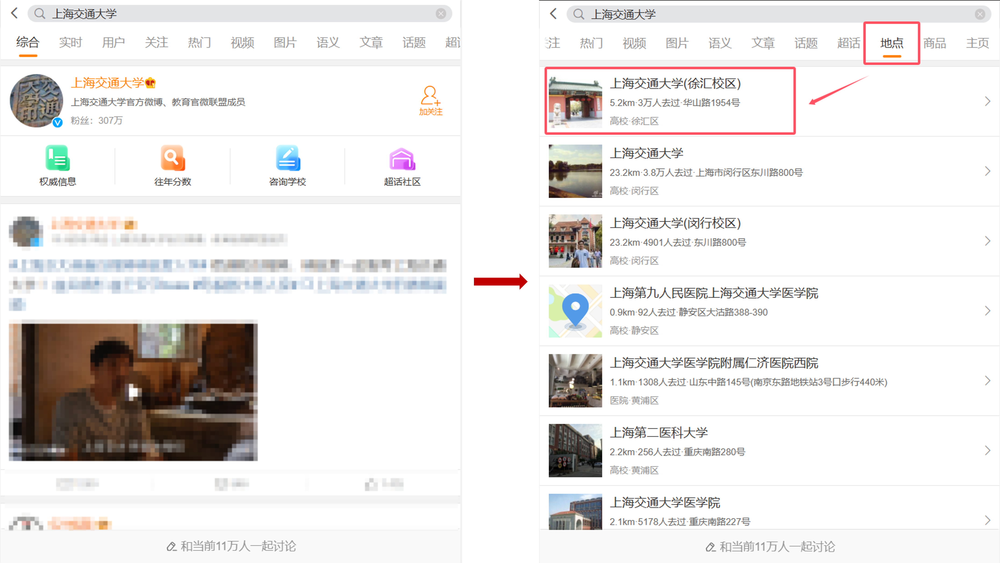
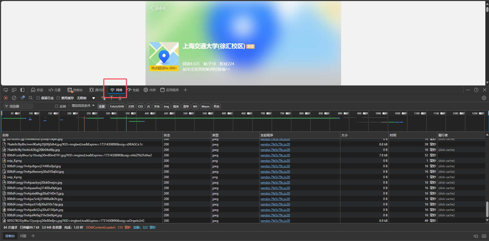
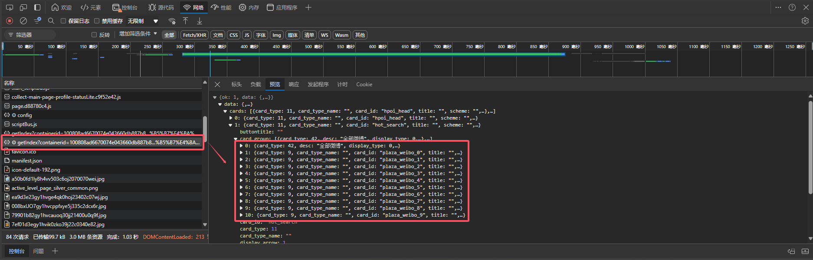
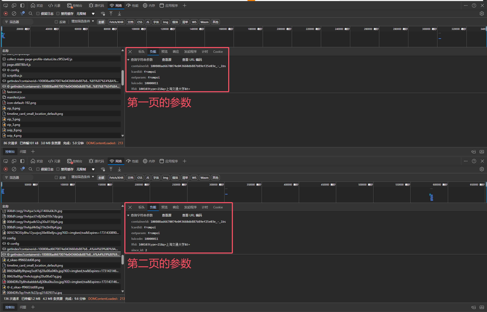

# 爬取带坐标的微博签到

## 项目简介

本项目用于爬取微博 POI（Point of Interest，兴趣点） 数据，以及用户在对应 POI上 的签到数据。通过两个表数据的字段连接，就可以得到带有坐标的微博签到。
- `微博POI数据包括`：poiid、poi名称（title）、经纬度（lon/lat）、地址（address）和文本描述（address）。
- `对应POI上的签到数据包括`：mid、uid、签到文本（text）、签到设备类型（source）、签到时间（created_at）和签到图片url（pics）。

目录有两个python文件和一个配置文件：
- `爬取微博POI.ipynb`：用于抓取微博POI（参考了这位大佬的逻辑：[参考连接](https://gitee.com/Jongsh/weibo-poi-crawler)）。
- `爬取微博POI上的用户签到.ipynb`：用于抓取对应微博 POI 上的用户签到。
- config
	- `weibo_cookies.txt`：用于抓取微博 POI 描述信息和用户签到，可以运行 `爬取微博POI.ipynb` 中`登录网页端微博`代码框中的代码获取参数。前提是配置 `selenium` 所需的插件（Chrome和Edge）。
	- `headers.txt`：微博接口所需的请求头，可以在[微博地图接口](https://place.weibo.com/wandermap/?pcid=B2094251DB6FABFC489A)获取。在开发者平台搜索`search1`获取对应的请求参数。
	- `params.txt`：搜索微博POI所需的参数配置，用于记录已爬取的搜索参数。

数据存放在PostgreSQL数据库。也可以根据自己的需求更改存储形式（excel或其它数据库）。

## 如何使用

### 爬取微博POI

- 请查看这位博主的说明：[参考连接](https://gitee.com/Jongsh/weibo-poi-crawler)。
- 修改配置文件 `config/params.txt` 中的 `containerid` 参数。下面是搜索上海市地表POI的示例。我发现 `containerid` 除了城市代码可以切换，另一个参数可以切换：`23044100{id}__80086{city_code}0000000000`。对于上海市，`id` 可以设置 `23-31`，其它城市可以自行测试。
```python
{
    "containerid": "2304410027__8008631000000000000",
    "page_type": "01",
    "page": 1
}
```
- 城市代码可以查看微博的[省份城市编码表](https://open.weibo.com/wiki/%E7%9C%81%E4%BB%BD%E5%9F%8E%E5%B8%82%E7%BC%96%E7%A0%81%E8%A1%A8)。如果打不开，多刷新几次。
<center><center>
	
- 配置好文件之后，逐行运行 `爬取微博POI.ipynb` 中的代码框即可爬取微博POI。

### 爬取微博POI上的用户签到

- 利用[手机端url](https://m.weibo.cn/)和微博POI的唯一标识符 `poiid`。
- 用到的接口：`https://m.weibo.cn/api/container/getIndex?containerid=2306570042{poiid}&luicode=10000011&lfid=100103&q={name}&t=&page={page}`。
- 这是上海市的接口，其中 poiid、name 和 page 是需要循环切换的。
- 其它城市的接口需要利用手机端自己找。

### 找接口
1. 利用[手机端url](https://m.weibo.cn/)搜索需要爬取城市的热门地标：我们以上海为例，搜索热门地标[上海交通大学（徐汇校区）](https://m.weibo.cn/p/index?containerid=100808ad6670074e043660db887b89ef25e03e_-_lbs&lcardid=frompoi&extparam=frompoi&luicode=10000011&lfid=100103type%3D21%26q%3D%E4%B8%8A%E6%B5%B7%E4%BA%A4%E9%80%9A%E5%A4%A7%E5%AD%A6%26t%3D)。
<center><center>

2. 进入页面然后到开发者模式，一般可以按F12。需要刷新一次页面，才能看见响应数据。
<center><center>

3. 一般`getIndex`开头的js文件就是数据接口。
<center><center>

4. 负载里面的参数需要修改，以获取不同POI，不同页的数据。向下滚动查看下一页参数。
<center><center>

## 结果

<center><center> 

- 遍历结束后，得到了接近两万个微博POI，但清洗后只有 8000 多个 POI 落在上海大市。
<center><center> 
	
- 用户签到只有最近几年的数据，太早的数据该接口不能获取。
- 抓取了这些POI上的用户签到，有 1000 多个POI没有签到数据，总计抓取了近 50 万条带有坐标的微博签到数据（原始数据）。
<center><center>

- 数据集放在上一级目录 `data/shanghai.zip`。

## 结语

**需要注意的是，爬虫技术的使用需要遵守相关法律法规和平台规定，合理利用爬虫技术，避免对平台造成不必要的负担。同时，对爬取到的数据进行合理使用，保护用户隐私和数据安全。分享的数据已经进行了处理，不会出现个人信息。**
